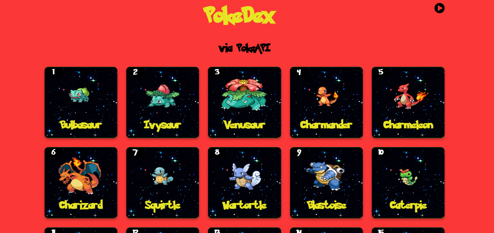

# pokedex-flask
This repository contains all the files and instructions to get your very own PokeDex up and running using Flask.

Pre-requisites: python3.6+, pip, venv (recommended)

## Installation

- Clone this repository: `git clone https://github.com/Jack-Lawton/pokedex-flask`
- Install all the required dependencies: `pip install -r requirements.txt`
- Run the flask app from root of the directory: `flask run`
- Go to `localhost:5000` on your browser to see your PokeDex up and running!

## Querying PokeAPI

- Refer the script `cache_data.py` 
- It is used to cache data by querying the PokeAPI, thereby reducing load time by eliminating the need to query the API for each Pokemon each time the web app reloads.
- The web app only displays the details of the Pokemon whose details have been cached.
- To change the number of Pokemon to be displayed, simply change the `max_pokemon` value to your desired number. 
- Additionally, by providing a file called `export.txt` in the root directory, a specific regional pokedex can be loaded.
  - Each row in export.txt must contain a pokemon's upper case name in brackets.
  - This is intentional to make it convenient to use [generation 3 pokemon decompilation](https://github.com/DizzyEggg/pokeemerald) pokedex files to create the export, where an example line might be, `SPECIES_TO_HOENN(LOTAD),`.
- Finally, run: `python3 caching-pokeapi-data.py`
